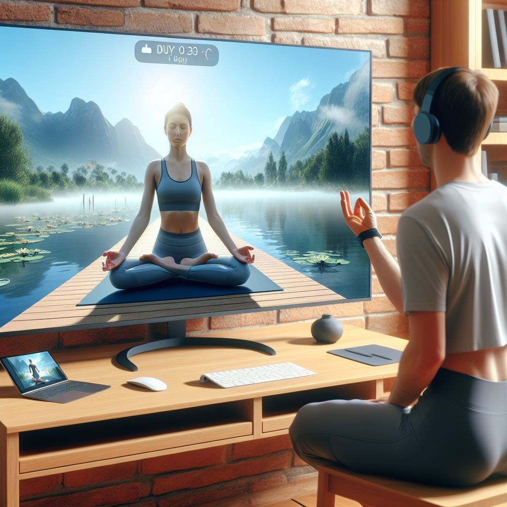

# YOGA COACH

## Introduction
The program is a yoga assistant that uses computer vision to monitor the user's poses and provide feedback. The program is written in Python, using libraries such as OpenCV, mediapipe to process the user's webcam input and apply pose estimation and recognition algorithms. The program also uses Unity, a cross-platform game engine, to create a realistic and interactive 3D environment where the user can see a virtual trainer and a user interface. The trainer demonstrates the correct poses and guides the user through a yoga session, while the user interface feedbacks on the user's progress. The program aims to help the user improve their yoga skills and enjoy a personalized and immersive experience.

## Computer Vision
The program uses computer vision to analyze the user’s body posture and movements from a webcam input. Computer vision is a field of artificial intelligence that enables computers to understand and process visual information, such as images and videos. The program uses various computer vision techniques, such as face detection and pose estimation, to identify the user’s body parts and joints, and compare them with the expected yoga poses.
The program uses libraries such as Mediapipe and OpenCV to implement machine learning algorithms, such as pre trained pose estimation neural network.
we use users poses and compare them with the Coach's pose as a refrence. this comparision is based on order of coordinate of each joint and the angel between the joints.

## Visuals
The program uses Unity to create a realistic and interactive 3D environment where the user can see a virtual trainer and a user interface. Unity is a cross-platform game engine that allows developers to create and run 3D and 2D games and applications. The program uses Unity to render and animate the virtual trainer, who demonstrates the correct yoga poses and guides the user through a yoga session. The program also uses Unity to design and display the user interface, which shows feedbacks on the user’s progress, as well as the option to choose different environments of meditation environments.

## Data Transfering between Unity and Python files
This part of the program is where can send and receive data between Unity and Python on the same machine. The program will use a socket, which is a communication channel that allows two processes to exchange information over a protocol. The program will consist of two parts: a Unity script and a Python script.
The program will use a common data format, such as JSON, to encode and decode the data before sending and after receiving. The program will also handle any potential errors or exceptions that might occur during the communication process. The program will aim to achieve a fast and reliable data transfer between Unity and Python on the same computer on realtime basis.

## Setup
1. Clone this project from GitHub using the following command:
```bash
git clone git@github.com:Mehdialmoo/VaneshingVisionary.git
```
2. open the folder in terminal and install the environment using the command below:
```bash
cd VaneshingVisionary
conda create YOG_ENV.yml
conda activate YOG_ENV
```
3. Download the latest version of Unity, and installthe unity after that the follow these steps:
    * Launch the Unity Hub.
    * Click Projects > Open.
    * Locate to the project's location on your machine using the file explorer and click Open.

    The project immediately opens in the Editor and is added to the Hub.

## Run
- to run the program firstly unity program:
  + run the test3.py
  + open the unity project, go to the particle Scene and run it.
## Demo


- In this video, the size of the particles represents the magnitude of the accuracy value, with a red display indicating that the position is less than 70% accurate.


- The closer to green means the smaller the accuracy value coming through.
- https://github.com/Ding-Jia-Layla/VaneshingVisionary/assets/128976273/2f5ad6bc-4418-4997-be84-cf6fe5223f3a

